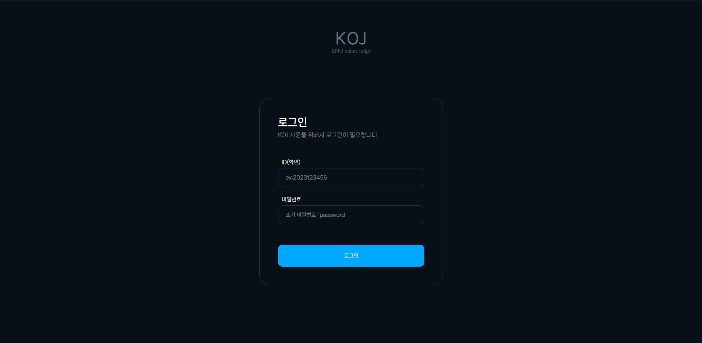
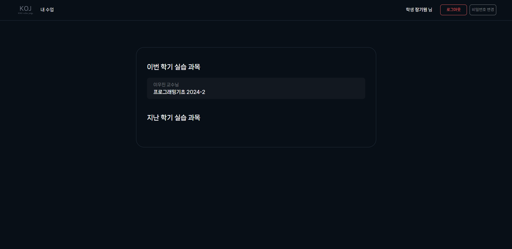
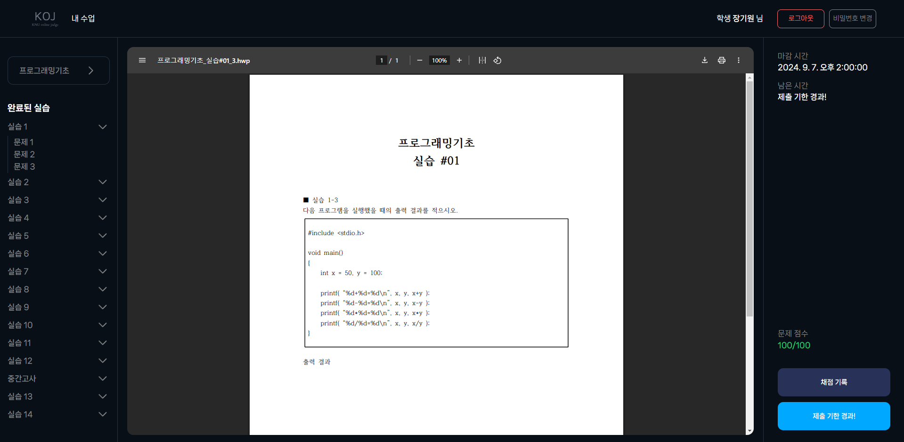
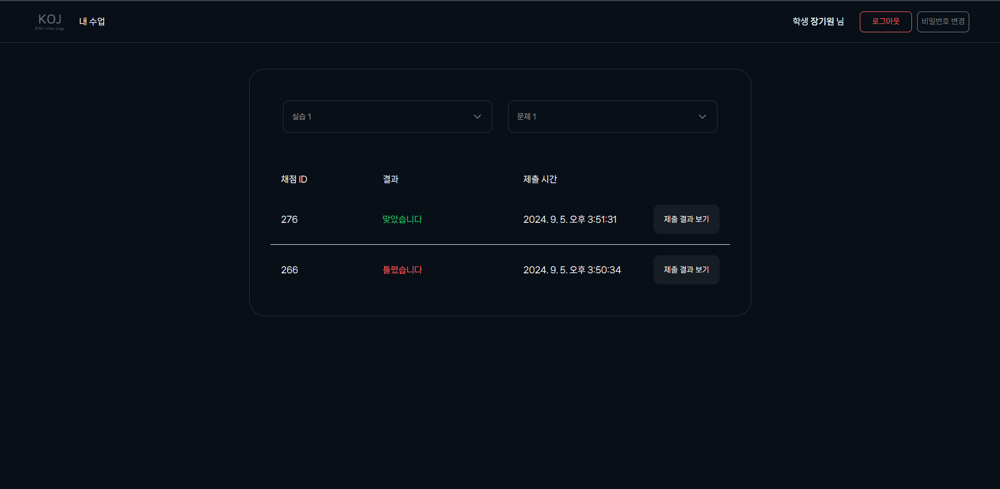
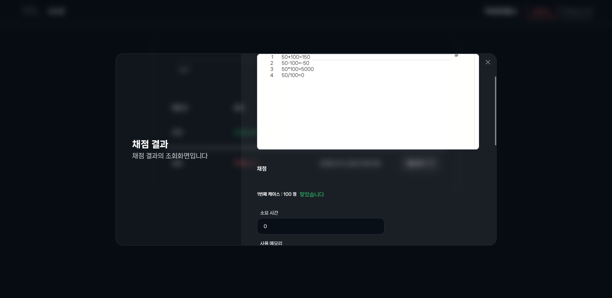

# Advanced-KOJ

향상된 KNU Online Judge UI/UX를 제공하는 Chrome Extension

## 적용 모습

1. 로그인
   

2. 로그인 후
   

3. 문제 뷰어
   

4. 제출 기록
   

5. 제출 기록
   

## 변경하는 것들

1. 다크 테마
2. 기본 HTML 태그 스타일
3. PDF 뷰어 사이즈
4. Nav 스타일

## 업데이트 할 것

- 불편한게 있으면 곧바로 수정할 듯
